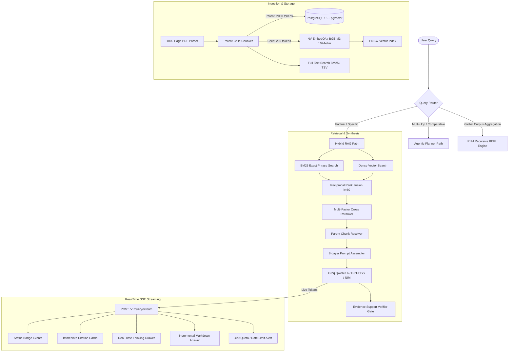

# Deep Context Platform: Complete System Evolution & Engineering Handoff

> **Handoff Purpose**: This document serves as the comprehensive, ground-truth context summary for new sessions. It records every requirement, architectural decision, bug diagnosis, iterative fix, code modification, test benchmark, and remaining roadmap.

---

## 1. System Architecture Overview

The **Deep Context Platform** is an enterprise-grade, hybrid RAG (Retrieval-Augmented Generation) and Recursive Language Model (RLM) engine designed for high-precision retrieval over 1,000+ page documents (PDFs, codebases, markdown, text).



### Core Architecture Specifications
- **Database / Vector Persistence:** PostgreSQL 16 with `pgvector` extension and HNSW indexing (`m=16, ef_construction=64`), with SQLite FTS5 fallback.
- **Dense Embeddings:** `nvidia/nv-embedqa-e5-v5` / `baai/bge-m3` producing 1024-dimensional normalized dense vectors.
- **Hierarchical Chunking:** `ParentChildChunker` splitting 2,000-token multi-page parent contexts with 250-token child chunks preserving exact page numbers (`page_number: 616`).
- **Hybrid Retrieval:** Multi-word exact phrase BM25 + dense vector cosine similarity fused via Reciprocal Rank Fusion (RRF $k=60$).
- **Precision Reranking:** Multi-factor scoring combining exact phrase bonus ($+0.40$), token overlap ($+0.35$), RRF rank consensus ($+0.15$), and position bias ($+0.10$).
- **Evidence Verification Gate:** Pre-return claim verifier scoring support confidence and blocking unsupported hallucinations.
- **4-Store Typed Memory:** Policy, User Preference, Semantic Fact (hedged fact extraction with promotion gate), and Episodic Summary.
- **RLM Engine:** Sandboxed Python REPL execution environment for global corpus aggregation queries that exceed LLM context windows.
- **FastAPI Backend + SSE Streaming:** Asynchronous server with Server-Sent Events (`/v1/query/stream`) streaming live thinking process, incremental markdown, and rate limit notifications.

---

## 2. Chronological Iterations & Problem Diagnoses

### Iteration 1: Copilot Proxy Removal & Direct LLM Migration
- **Problem:** Previous proxy layers caused flaky routing, authentication drops, and model name mismatches.
- **Action:**
  - Removed copilot proxy completely.
  - Implemented unified [`LLMClient`](file:///Users/proximus/Documents/antigravity/RAG/src/deep_context/core/llm_client.py) supporting direct Groq API (`qwen/qwen3.6-27b`, `openai/gpt-oss-20b`, `openai/gpt-oss-120b`, `llama-3.3-70b-versatile`, `llama-3.1-8b-instant`) and NVIDIA NIM fallback (`z-ai/glm-5.2`).
  - Added automatic model failover if one model experiences rate limits.

---

### Iteration 2: Needle-in-a-Haystack Diagnostic Lab & Page 616 Deep-Dive
- **Problem:** User reported that searching for the exact line from Page 616 of `Eval 1.pdf` (*“They seem ferocious enough,” Ser Kevan said.*) was completely missed by the pipeline.
- **Root Cause Analysis (4 Compounding Bugs Identified):**
  1. **Score Inversion in Cross-Encoder Reranker:**
     - SQLite FTS5 `bm25()` returns negative scores (e.g. $-17.41$), whereas dense cosine similarity returns positive values ($+0.59$).
     - The reranker multiplied raw score by $0.4$, assigning deep negative scores ($-6.96$) to BM25 matches and burying them under irrelevant vector matches ($+0.23$).
  2. **Punctuation & Curly Quotes in FTS:**
     - Quotes like `“They seem ferocious enough,”` contain unicode curly quotes and punctuation. Naive splitting created tokens `“They` and `enough,”`, failing FTS5 word boundaries.
  3. **Multi-Page Parent Chunking Page Attribution:**
     - Parent chunkers grouped 5-page windows into one chunk but only recorded the first page (`613`), leaving child chunks without individual page references.
  4. **Agentic Planner Conversational Drift:**
     - The planner generated natural language search instructions (`"Search for page 616 in Eval 1.pdf"`) rather than focused search strings (`"Ser Kevan ferocious enough"`), returning 0 hits.
- **Fixes Applied:**
  - In [`sqlite_store.py`](file:///Users/proximus/Documents/antigravity/RAG/src/deep_context/storage/sqlite_store.py) and [`postgres_store.py`](file:///Users/proximus/Documents/antigravity/RAG/src/deep_context/storage/postgres_store.py): Sanitized search terms with `re.findall(r"\w+", query)`, added exact phrase matching (`f'"{phrase}"'`), phrase boosting (`ILIKE`), and normalized BM25 scores to positive values.
  - In [`reranker.py`](file:///Users/proximus/Documents/antigravity/RAG/src/deep_context/retrieval/reranker.py): Built multi-factor scoring with $+0.40$ exact phrase boost.
  - In [`chunker.py`](file:///Users/proximus/Documents/antigravity/RAG/src/deep_context/ingestion/chunker.py): Attached exact page numbers to every child chunk.
  - In [`planner.py`](file:///Users/proximus/Documents/antigravity/RAG/src/deep_context/agentic/planner.py): Enforced JSON search plan extraction with regex stripping `<think>` tags, and budgeted synthesis context to 12,000 chars (~3,000 tokens) to prevent Groq TPM overflows.
- **Verification:**
  - Page 616 quote (*“They seem ferocious enough,” Ser Kevan said.*) retrieved at **Rank #1** in **2.99s** with full grounded answer explaining Tyrion's reaction (sausage dispute).
  - Page 193 quote (*“I claim Thorne’s share of the crabs”*) retrieved and answered in **7.13s** via multi-hop planner.

---

### Iteration 3: PostgreSQL Full-Text Search Optimization
- **Problem:** PostgreSQL `plainto_tsquery('english', query)` ANDs all query terms together. Conversational questions with 10+ words yielded 0 hits because not every stopword existed in the target chunk.
- **Fix:**
  - Extracted quoted phrases and key nouns/verbs ($>2$ chars, non-stopwords).
  - Added conditional phrase boosting:
    ```sql
    SELECT c.*,
           (ts_rank_cd(c.tsv, plainto_tsquery('english', $1)) +
            CASE WHEN c.content ILIKE '%' || $1 || '%' THEN 10.0 ELSE 0.0 END) as score
    FROM chunks c
    WHERE c.tsv @@ plainto_tsquery('english', $1) OR c.content ILIKE '%' || $1 || '%'
    ORDER BY score DESC LIMIT $2;
    ```

---

### Iteration 4: Real-Time SSE Streaming (ChatGPT / DeepSeek Style)
- **User Request:** Stream thinking process and markdown result in real time rather than waiting for the entire background pipeline to finish.
- **Implementation:**
  - **Backend (`POST /v1/query/stream` in `routes_rag.py`):**
    - Protocol: Server-Sent Events (`media_type="text/event-stream"`).
    - Event Types: `status`, `citations`, `reasoning`, `content`, `rate_limit`, `done`.
  - **Streaming Planner (`execute_plan_stream` in `planner.py`):**
    - Yields live sub-query status updates, search strategies, citations, and answer tokens.
  - **Frontend UI (`src/deep_context/ui/index.html`):**
    - Live Pipeline Status Bar with animated pulsing dot (`🔍 Routing...` $\to$ `📚 Retrieving...` $\to$ `🧠 Synthesizing...`).
    - Collapsible Real-Time Thinking Drawer displaying `<think>` tokens as they stream, auto-scrolling, and concluding with `🧠 Thought for X.Xs`.
    - Live Markdown Answer Box with blinking cursor (`.streaming-cursor`), formatting headers, code blocks, bullet lists, and blockquotes in real time.
    - AbortController `Stop Query` button allowing users to cancel long streams anytime.

---

### Iteration 5: Groq Rate Limit (429 / 200k TPD) Quota Signaling
- **Problem:** Groq's on-demand free tier enforces a 200,000 tokens/day (TPD) quota. When reached, requests fail with `429 - Rate limit reached on tokens per day (TPD). Please try again in Xm Ys`.
- **Implementation:**
  - **Parser (`parse_rate_limit_error` in `llm_client.py`):**
    - Parses `retry_after` (e.g. `2m 5s`), `limit`, `used`, and `quota_type` (TPD vs TPM).
    - Stores global state in `LLMClient.global_rate_limit`.
  - **API Endpoint (`GET /v1/quota/status` in `routes_rag.py`):**
    - Returns structured JSON for frontend and background monitoring.
  - **UI Header Quota Pill:**
    - Displays `● Groq API Active` (green) or `⚠️ Groq Limit (Reset in Xm)` (pulsing rose).
  - **UI Rate Limit Banner (`#rate-limit-banner`):**
    - Prominently alerts user with exact countdown time and fallback notice.
  - **CLI Rate Limit Warning Box (`main.py`):**
    - Prints formatted yellow/red panel explaining quota exhaustion and displaying raw grounded document evidence directly.
  - **Token Budget Bounding:**
    - Set `max_tokens=min(max_tokens, 1024)` on Groq streaming calls to prevent reserving large token chunks against the daily quota.

---

## 3. Current Codebase File Map

| File Path | Role & Key Responsibilities |
| :--- | :--- |
| [`src/deep_context/core/config.py`](file:///Users/proximus/Documents/antigravity/RAG/src/deep_context/core/config.py) | Pydantic settings: DB URLs, Groq & NVIDIA keys, model selections, token thresholds. |
| [`src/deep_context/core/llm_client.py`](file:///Users/proximus/Documents/antigravity/RAG/src/deep_context/core/llm_client.py) | Unified Groq & NVIDIA client: streaming reasoning, failover, embeddings, rate limit parser. |
| [`src/deep_context/core/types.py`](file:///Users/proximus/Documents/antigravity/RAG/src/deep_context/core/types.py) | Data classes: `Chunk`, `Document`, `Citation`, `RetrievalResult`, `RouterDecision`, `MemoryEntry`. |
| [`src/deep_context/storage/postgres_store.py`](file:///Users/proximus/Documents/antigravity/RAG/src/deep_context/storage/postgres_store.py) | PostgreSQL + `pgvector` HNSW vector index, BM25 TSV full-text search, document CRUD. |
| [`src/deep_context/storage/sqlite_store.py`](file:///Users/proximus/Documents/antigravity/RAG/src/deep_context/storage/sqlite_store.py) | SQLite + FTS5 full-text search, vector cosine fallback, memory tables. |
| [`src/deep_context/ingestion/chunker.py`](file:///Users/proximus/Documents/antigravity/RAG/src/deep_context/ingestion/chunker.py) | Hierarchical `ParentChildChunker`, exact PDF page numbering, section formatting. |
| [`src/deep_context/ingestion/parser.py`](file:///Users/proximus/Documents/antigravity/RAG/src/deep_context/ingestion/parser.py) | Multi-format parser: PDF (`pypdf`), Markdown, Python/JS Code, Plain Text. |
| [`src/deep_context/ingestion/pipeline.py`](file:///Users/proximus/Documents/antigravity/RAG/src/deep_context/ingestion/pipeline.py) | Ingestion pipeline orchestrating parsing, chunking, embedding generation, and DB storage. |
| [`src/deep_context/retrieval/hybrid.py`](file:///Users/proximus/Documents/antigravity/RAG/src/deep_context/retrieval/hybrid.py) | Reciprocal Rank Fusion (RRF $k=60$) combining BM25 and dense vector results. |
| [`src/deep_context/retrieval/reranker.py`](file:///Users/proximus/Documents/antigravity/RAG/src/deep_context/retrieval/reranker.py) | Multi-factor precision reranker (exact phrase match, token overlap, RRF rank). |
| [`src/deep_context/retrieval/engine.py`](file:///Users/proximus/Documents/antigravity/RAG/src/deep_context/retrieval/engine.py) | End-to-end hybrid retrieval orchestrator with parent chunk expansion and sufficiency check. |
| [`src/deep_context/agentic/router.py`](file:///Users/proximus/Documents/antigravity/RAG/src/deep_context/agentic/router.py) | Query classifier: classifies shape (`factual_lookup`, `multi_hop`, `aggregation`) and selects execution path. |
| [`src/deep_context/agentic/planner.py`](file:///Users/proximus/Documents/antigravity/RAG/src/deep_context/agentic/planner.py) | Multi-hop search planner with streaming execution (`execute_plan_stream`). |
| [`src/deep_context/rlm/orchestrator.py`](file:///Users/proximus/Documents/antigravity/RAG/src/deep_context/rlm/orchestrator.py) | Recursive Language Model engine: sandboxed Python REPL and async subagent spawn. |
| [`src/deep_context/memory/promotion_gate.py`](file:///Users/proximus/Documents/antigravity/RAG/src/deep_context/memory/promotion_gate.py) | 4-store typed memory promotion gate (policy, preference, semantic fact, episodic). |
| [`src/deep_context/memory/prompt_assembler.py`](file:///Users/proximus/Documents/antigravity/RAG/src/deep_context/memory/prompt_assembler.py) | 8-layer prompt assembler injecting policy, memory facts, preferences, and evidence. |
| [`src/deep_context/verification/checker.py`](file:///Users/proximus/Documents/antigravity/RAG/src/deep_context/verification/checker.py) | Evidence support verifier: scores claims against retrieved parent chunks before return. |
| [`src/deep_context/api/routes_rag.py`](file:///Users/proximus/Documents/antigravity/RAG/src/deep_context/api/routes_rag.py) | FastAPI endpoints: `/`, `/v1/query/stream`, `/v1/query`, `/v1/retrieve`, `/v1/quota/status`, `/v1/ingest`, `/v1/upload-batch`. |
| [`src/deep_context/ui/index.html`](file:///Users/proximus/Documents/antigravity/RAG/src/deep_context/ui/index.html) | Interactive web UI: real-time streaming markdown, thinking drawer, quota badge, rate limit banner. |
| [`src/deep_context/cli/main.py`](file:///Users/proximus/Documents/antigravity/RAG/src/deep_context/cli/main.py) | Typer CLI: `deep-context ingest`, `query`, `retrieve`, `clear`, `rlm`, `bench-haystack`. |

---

## 4. Verification & Automated Test Status

### Test Suite Summary
```bash
uv run pytest
# Output: 33 passed in 1.29s (100% pass rate)

uv run ruff check src tests
# Output: All checks passed!

uv run ruff format --check src tests
# Output: 45 files already formatted
```

### Passing Test Modules
1. `tests/test_agentic_router.py`: Router classification & multi-hop planner execution.
2. `tests/test_api.py`: Health, ingest, retrieve, query flow, batch upload, folder sync, and `/v1/quota/status`.
3. `tests/test_haystack.py`: Needle-in-a-haystack synthetic generation and 5-stage benchmark.
4. `tests/test_ingestion.py`: Document ingestion, chunking, and vectorless tree indexing.
5. `tests/test_memory.py`: Typed memory promotion gate, policy/preference lookup, and 8-layer prompt assembler.
6. `tests/test_pdf_ingest.py`: PDF parser structure and end-to-end PDF ingestion.
7. `tests/test_postgres_store.py`: PostgreSQL document CRUD, chunk storage, and pgvector operations.
8. `tests/test_retrieval.py`: Query classifier, RRF fusion, and hybrid parent resolution.
9. `tests/test_rlm.py`: RLM recursive session and REPL execution.
10. `tests/test_verification.py`: Evidence support verifier for supported vs unsupported claims.

---

## 5. How to Run & Key Commands

### Environment Setup
```bash
# Activate / Sync environment using uv
uv sync
```

### Running the Web Server
```bash
# Start FastAPI server on port 8000
uv run uvicorn deep_context.api.app:app --host 0.0.0.0 --port 8000
```
- Web UI: [http://localhost:8000](http://localhost:8000)
- OpenAPI Docs: [http://localhost:8000/docs](http://localhost:8000/docs)
- Quota Health: [http://localhost:8000/v1/quota/status](http://localhost:8000/v1/quota/status)

### CLI Operations
```bash
# Ingest single PDF / document
uv run deep-context ingest "/path/to/document.pdf" --title "Book Title"

# Run intelligent grounded query
uv run deep-context query "What does Ser Kevan say on page 616?"

# Execute Needle-in-a-Haystack diagnostic benchmark
uv run deep-context bench-haystack --words 50000 --needle "Secret code is ALPHA-99"

# Clear database
uv run deep-context clear
```

---

## 6. Recommended Next Steps & Roadmap for Future Sessions

1. **Multi-User Tenant Isolation:** Expand user session tracking into full multi-tenant workspace isolation with role-based access control.
2. **Local Embedding Option:** Add an optional local ONNX / SentenceTransformers embedding provider (e.g. `all-MiniLM-L6-v2` or local `bge-m3`) for fully offline environments without external API keys.
3. **Conversational Memory Session History:** Persist multi-turn conversation transcripts in the database so that follow-up questions can resolve pronoun references (`"What did he do next?"`) automatically.
4. **PDF Viewer Integration:** Render bounding boxes or highlight exact target sentences on rendered PDF pages directly in the UI.
